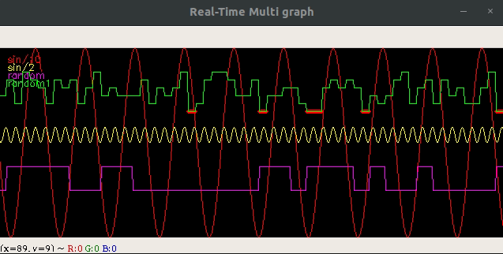

### OpenCV multigraph

This is a simple but useful utility implementation for a multi-graph time series visualization in python OpenCV. 
Features:
- multi signals on the same graph
- position, color, title settings
- markers setting for the interest points


<p align="center"> 
  </a>
</p>

### How to use it?

1. clone the project
2. import in your project the ```utils/muligraph.py```
3. create an instance for "multigraph" object ```rtmg = RealTimeMultiGraph(shape=[IMG_H,IMG_W,IMG_CHANNEL],nr_of_graphs=NR_OF_GRAPHS)```
4. optionally set the graph color/parameters
```
ex. setup a single graph with parameters
# set properties
rtmg.set_color(0,[0,0,255])
rtmg.set_scale(0,10)
rtmg.set_offset(0,110)
rtmg.set_marker(0,value=5,size=2,color=[0,0,255])
rtmg.set_title_and_position(0,"sin/10",(10,10))

```

See details of a working example in ```python test_multigraph.py```.

/Enjoy.